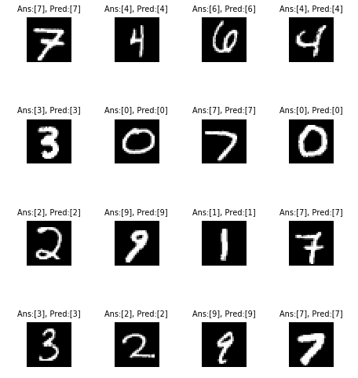
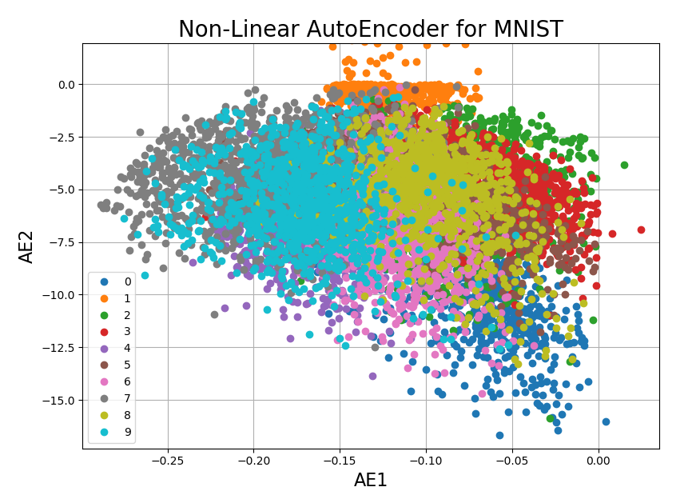
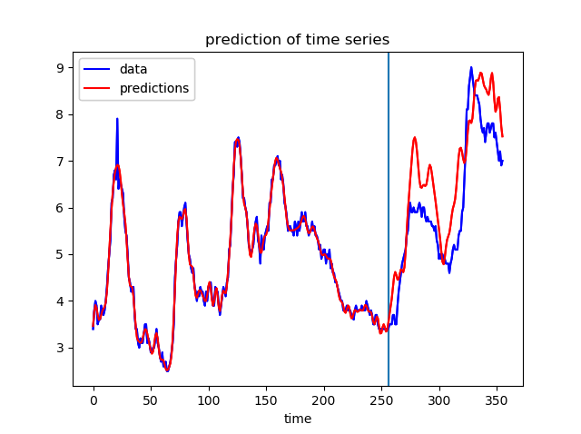

<p align="center">
  
</p>

Qualia is a deep learning framework deeply integrated with autograd designed for maximum flexibility. Qualia features in automatic differentiation and dynamic graphing.

### introduction

Physicalism, which considers there is nothing over or above the physical, has been criticized by Thomas Nagel (What is it like to be a bat?), Frank C. Jackson (Mary's Room),  David J. Chalmers (Philosophical zombie) and others mainly because it lacks descriptions for the hard problem of consciousness. In the paper "[Absent Qualia, Fading Qualia, Dancing Qualia](http://consc.net/papers/qualia.html)," David argues that if a system reproduces the functional organization of the brain, it will also reproduce the qualia associated with the brain. This library "Qualia" named after the series of arguments in philosophy of mind associated with the qualia, hoping for the creation of a system with subjective consciousness. 

### overview

Qualia is a library that consists of the following components:

| Component | Description |
| ---- | --- |
| **qualia** | a deep learning framework utilizing NumPy |
| **qualia.autograd** | a wrapper class for NumPy that supports a dynamic automatic differentiation|
| **qualia.nn** | a neural networks library deeply integrated with autograd designed for maximum flexibility |
| **qualia.data** | provides datasets for handy testing |
| **qualia.optim** | optimizers for training neural nets |
| **qualia.util** | DataLoader, Trainer and other utility functions for convenience |

## Requirements

* Python 3.x
* numpy
* matplotlib 
* h5py 
* tqdm

## Installation
```
$ python setup.py install
```

## Examples

### classification with CNN

Classification of handwritten digits done on [mnist](http://yann.lecun.com/exdb/mnist/) dataset using CNN


<p align="center">
  
</p>

### PCA with non-linear autoencoder

Dimensionality Reduction is a technique widely used in data science to visualize data.
The following image is the plot of two principal components of handwritten digits found by non-linear autoencoder.

<p align="center">
  
</p>

### time series prediction

Regression of a neural network with sinusoidal activation functions done on labor_stats data


<p align="center">
  
</p>

## Tutorials 

### automatic differentiation (AD)
Fundamental to automatic differentiation [(AD)](https://en.wikipedia.org/wiki/Automatic_differentiation) is the decomposition of differentials provided by the chain rule. Qualia implements the reverse accumulation AD in qualia.autograd.

In the example code of this tutorial, we assume for simplicity that the following symbols are already imported.
```python
import numpy as np
from qualia.autograd import Variable
```
Qualia uses the so called “Define-by-Run” scheme, so forward computation itself defines the network. By using a Variable object, Qualia can keep track of every operation. Here, the resulting y is also a Variable object.
```python
x = Variable(np.array([5]))
y = x**2 - 2*x + 1
# prints result of the computation: 
# [16]
print(y.data)
```
At this moment we can compute the derivative.
```python
y.backward()
# prints gradient of x:
# [8]
print(x.grad)
```
All these computations can be generalized to a multidimensional tensor input. When the output is not a scalar quantity, a tenspr  with the same dimentions as the output that is filled with ones will be given by default to start backward computation.
```python
x = Variable(np.array([[1, 2, 3], [4, 5, 6]]))
y = x**2 - 2*x + 1
y.backward()
# prints gradients of x:
# [[ 0  2  4]
#  [ 6  8 10]]
print(x.grad)
```

### define network
An nn.Module contains layers, and a method "forward" that returns the output.
```python
class ConvNet(Module):
    def __init__(self):
        super().__init__()
        self.conv1 = Conv2d(1, 6, 5)
        self.conv2 = Conv2d(6, 16, 5)
        self.fc1 = Linear(16 * 5 * 5, 120)
        self.fc2 = Linear(120, 84)
        self.fc3 = Linear(84, 10)

    def forward(self, x):
        x = max_pool2d(relu(self.conv1(x)), (2,2))
        x = max_pool2d(relu(self.conv2(x)), (2,2))
        x = reshape(x, (-1,*x.shape))
        x = relu(self.fc1(x))
        x = relu(self.fc2(x))
        x = self.fc3(x)
        return x
```
The learnable parameters of a model are returned by model.params()

```python
model = ConvNet()
params = [i for i in model.params()]
# print conv1's params
# (6, 1, 5, 5)
print(params[0].shape)
```
## License

Source codes in the repository follows [MIT](http://www.opensource.org/licenses/MIT) license.

## Citation

Please cite **Qualia** if you use in your research.

```bibtex
@misc{qualia,
  author = {Kashu Yamazaki},
  title = {{Q}ualia},
  year = {2018},
  publisher = {GitHub},
  howpublished = {\url{https://github.com/Kashu7100/Qualia}},

}
```
